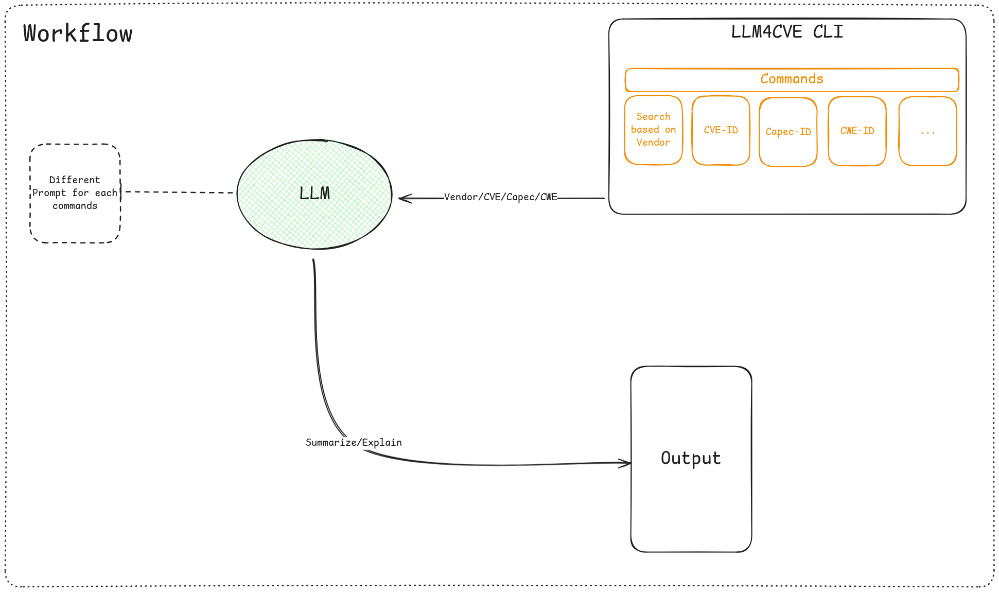

# LLM4CVE

**LLM4CVE** is a command line tool that use LLM 
to analyze and summarize **C**ommon **V**ulnerabilities and **E**xposures (CVEs).
Given a CVE (or a list) the system generate a summary of their description.

### Tool Used

- Langchain Framework
- Ollama (DeepSeek)
- Go

### Cli Workflow


```
# Authors
@GiovanniMenon
@NicoloPellegrinelli
```